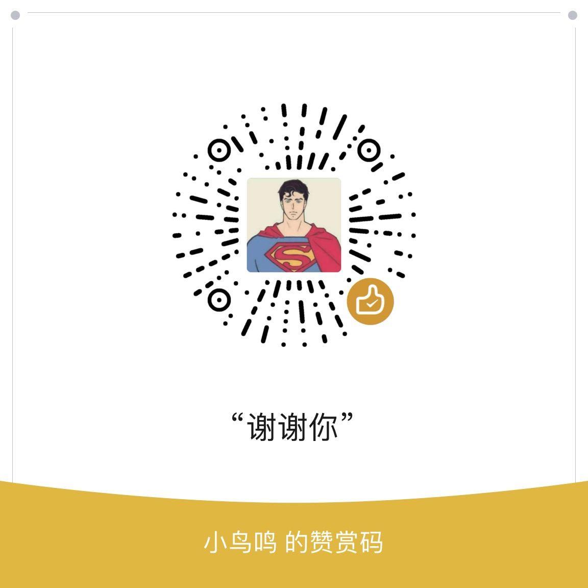

## 配置下发

企业微信群里机器人 定时发送消息,
```api格式
{
  "name": "每日提醒",
  "webhook_url": "https://qyapi.weixin.qq.com/cgi-bin/webhook/send?key=key",
  "message_type": "text",
  "message_content": "这是一条每天上午9点的提醒消息",
  "schedule_time": "00 9 * * *"
}
```

```使用方法
timetask.sql
根目录启动三个
cd backend
celery -A app.task.celery flower --port=8555 --basic-auth=admin:123456
celery -A plugin.wecom_task.celery worker -l info
celery -A plugin.wecom_task.celery beat -l info


```
